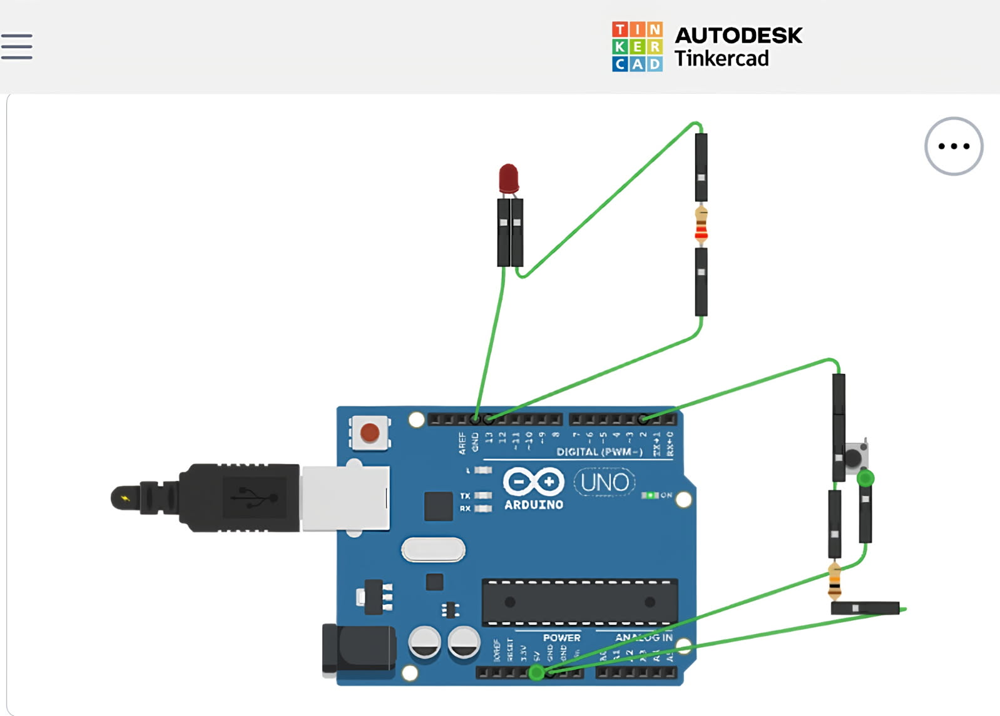

# LED_Button_Arduino_project
Simple Arduino project : control led with button
# 💡 LED Control with Push Button – Arduino Beginner Project

This project demonstrates how to turn an LED on and off using a push button with Arduino **without using a breadboard**. All components are directly connected using jumper wires.

---

## 🧰 Components Used

| Component      | Quantity |
|----------------|----------|
| Arduino Uno    | 1        |
| LED            | 1        |
| 220Ω Resistor  | 2        |
| Push Button    | 1        |
| Jumper Wires   | 5–6      |
| USB Cable      | 1        |

---

## ⚙️ Working Principle

- The push button is connected to digital pin `2`.
- When the button is pressed, the Arduino reads a HIGH signal and turns on the LED (connected to pin `13`).
- When released, the signal goes LOW, turning off the LED.

---

## 🖼️ Circuit Diagram

Below is the circuit built using **Tinkercad**, with direct connections and no breadboard:



## 💻 Arduino Code

```cpp
int ledPin = 13;       
int buttonPin = 2;     
int buttonState = 0;

void setup() {
  pinMode(ledPin, OUTPUT);
  pinMode(buttonPin, INPUT);
}

void loop() {
  buttonState = digitalRead(buttonPin);

  if (buttonState == HIGH) {
    digitalWrite(ledPin, HIGH);  // Turn on LED
  } else {
    digitalWrite(ledPin, LOW);   // Turn off LED
  }
}
